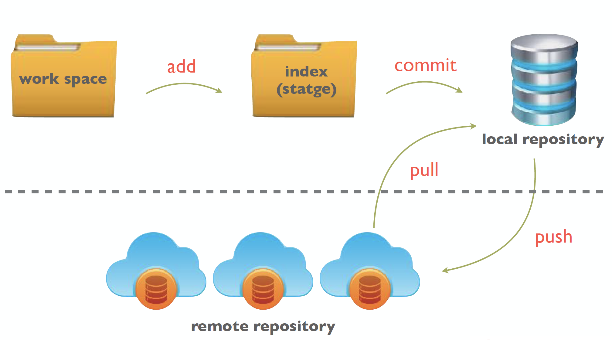
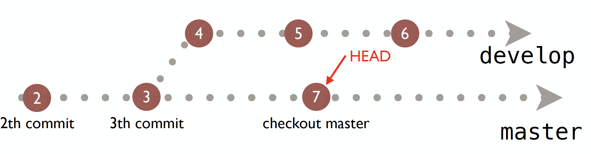
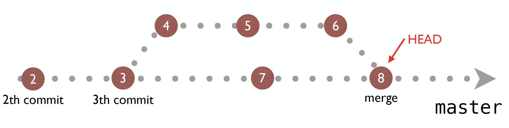

# Git

- **번외** PlayGround;아이들을 위한 Swift 이해를 돕는 Application *(iPad Only)*

## Git의 용도
- 각 버전별 관리가 필요
- 히스토리가 필요 
- 덮어쓰기 방지용
- 효과적인 협업을 위한 코드 공유

## Git이란?
**분산 버전 관리 시스템 중 하나**

### 1. 개념
- Repository(저장소)에 `commit`(저장)
- 종전 버전관리시스템의 단점 > 네트워크에 연결되어 있어야 한다. 
- Git은 이 점을 개선해서, 1차적으로 각 개인이 Repository를 개인의 컴퓨터에 가지고 있고, 나만의 이력관리를 하고, 필요한 부분만 네트워크에 올린다. 
> 결국, Repository가 두군데; 개인컴퓨터(Local,내부) & 네트워크(Remote,외부)

### 2. 장점
- CPU가 네트워킹보다 당연히 매우 빠르므로 속도가 빠름
- `commit` 하면 실수를 한 것에 대해 error가 있는지 체크썸을 통해 검사한 후 `commit`할 수 있다. *단, 컴파일러 수준의 error검사는 아님*
- **브랜치(branch)모델** 기능이 가장 어마어마한 기능

### 3. Git 과 Github의 차이? 
- Git은 무료이자 분산버전관리시스템 자체. 
- Github은 Remote Repository 제공 서비스 이름. ~네이버 클라우드 서비스 가입하듯이 로그인해서 내 저장소를 빌려서 가져다 쓰는 것~ 
- Git은 무료인 대신에 오픈소스로 올려야 한다. *비밀로 하려면 유료*

### 4. 구조

	- Work Space: 프로젝트를 저장해놓은 ‘폴더’
	- index staging 영역. 중간단계
	- 내부저장소: 숨김폴더형태로 있음
	- 외부저장소: 네트워크상 저장소 (github)

- `clone` remote repository 가 local repository로 복제 *(자동적으로 work space도 복제)*
- 사실상 `add` / `commit` / `push` 의 반복

### 5. Branch Model 이란?

	- Head: 최신버전이 아니라 활성화된 상태
	- Master: 완벽한 아이. 빌드하면 에러 없이 바로 돌아갈 깔끔한 상태
	- develop: 개발 중인 상태 (불완전 or 에러발생가능)

- checkout을 하면 가장 최근의 commit으로 이동하는 것이 아니라 새로운 commit이 생김.
- master branch는 하나. 그외 branch는 계속 늘어날 수 있다.
	

	- merge: merge한다고 브랜치가 사라지는 것은 아니다.
	- 보통 브랜치와 브랜치를 merge할 때 컴플릭크(충돌)이 가장 많이 일어남.
	- 충돌이 일어난다고 해서 merge가 안되는 것은 아니다. 
	- 충돌된 상태 자체가 새로운 branch로 생성됨. 
	- 충돌을 해결하고 나서 merge하면 됨

### 6. 좀 더 전문적이고 재미없는 위키위키

- [git 개발자 리누스 토르발스](https://ko.wikipedia.org/wiki/리누스_토르발스)
- [git이란?](https://ko.wikipedia.org/wiki/깃_(소프트웨어))

### 7. Terminal 명령어
*리눅스 명령어 공부해보는 것도 좋다*

- `clear` 모두 지우기
- `ls` 디렉토리보기
- `ls -a` 모든 디렉토리보기
- `open .` 현재 디렉토리 열기
- `~` 홈폴더
- `cd (폴더명)` 폴더 디렉토리로 가기 *(폴더명 일부를 치고 `tap키`를 치면 유사한 폴더명 자동완성)*
- `vi (메모장명)` 텍스트 파일 생성/열기 
	- `i키` 입력-명령어
	- `esc키` insert 모드 종료
	- `:wq` w는 저장, q는 종료의 의미
- `.git` git이라는 폴더가 숨김폴더라는 뜻 *폴더 자체는 `.`*
- `git init` 프로젝트의 git을 생성
- `mkdir (폴더명)` 폴더 만들기
- `git reflog` 생성한 commit & 입력한 message 확인
- Head 0 으로 표시되는 부분이 최신

> **`git init` / `add` / `commit` 은 완전히 익힐것**
	
- `remote add (원격저장소명;origin) (URL)` Remote Repository를 연결
- `git push origin master` 연결한 RR에 Push
- `rm -rf .git` git 제거
- git 이 있는 폴더의 하위 폴더에 또 git을 만들면 안된다
- Github의 로그가 중요

###8. Git Ignore
내가 만들지 않았는데 원치 않게 git에 포함되는 폴더가 있는경우 git commit시, tracking자체를 하지 않고 commit 하게 해주는 것. ***[gitignore.io](https://www.gitignore.io) search `xcode``swift`***