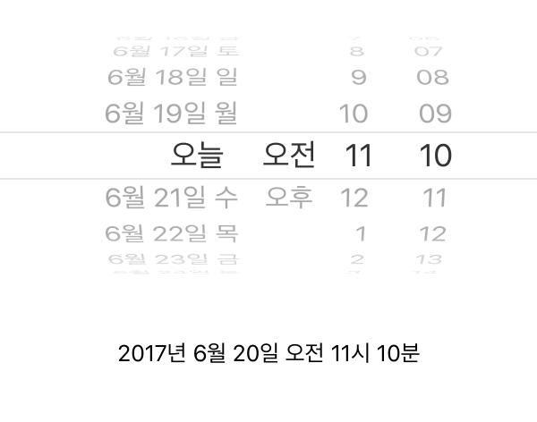

## 조교님 Tip

- UIDataPicker, Date, DateFormatter 를 이용한 날짜 출력

	```swift
	    /****************************************************/
	    //                 IBOutlet / 전역변수                 //
	    /****************************************************/
	    @IBOutlet weak var showSelectedTimeLabel: UILabel!
	    @IBOutlet weak var datePickerOutlet: UIDatePicker!
	    var dateFormatter:DateFormatter = DateFormatter()
	    
	    
	    /****************************************************/
	    //                      IBAction                    //
	    /****************************************************/
	    @IBAction func datePicker(_ sender: UIDatePicker) {
	    self.showSelectedTimeLabel.text = self.dateFormatter.string(from: sender.date)
	    }
	    
	    
	    /****************************************************/
	    //                     LifeCycle                    //
	    /****************************************************/
	    override func viewDidLoad() {
	        super.viewDidLoad()
	        
	        dateFormatter.dateFormat = "yyyy년 M월 d일 a h시 m분"
	        dateFormatter.locale = Locale(identifier: "KO_KR")
	        datePickerOutlet.locale = Locale(identifier: "KO_KR")
	        self.datePickerOutlet.date = Date()
	        self.showSelectedTimeLabel.text = self.dateFormatter.string(from: datePickerOutlet.date)
	        
	    }
	```

- 실행 스크린 샷 


# Notification

